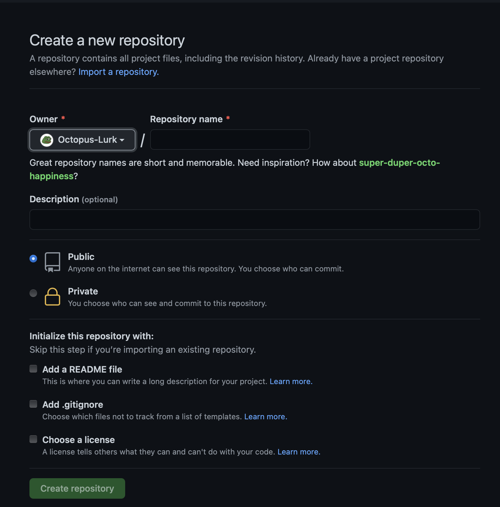

[ < к содержанию ](./readme.md)
# Создание вашего репозитория.
---
После того как вы установили [_Git_](./git-setup.md) и [_GitHub Desktop_](./hubinstal.md) , вам следует создать ваш первый репозиторий.

Для этого вам надо:
* Зайдти в вашу учетную запись.
* В правом в верхнем углу экрана нажать на эконку вашего профиля и выбрать (*Your repositories*).
* Далее нажать на иконку *New* 
* Ввести название вашего репозитория.
* Выбрать каким будет ваш репозиторий (*публичным или приватным*).
* Далее нажимате (*Creat repositor*).

*Поздраляю вы только что создали свой первый репозиторй!*

