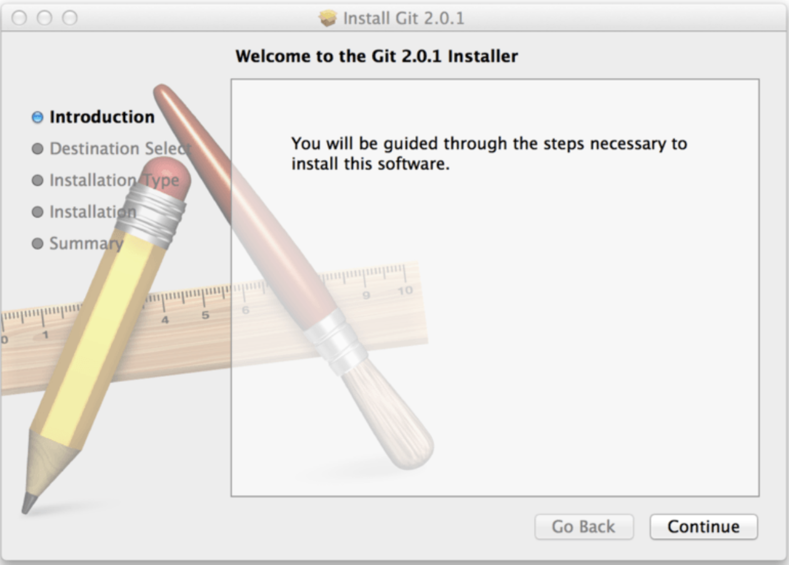

# Установка Git.
---
**Прежде чем использовать *Git*, вы должны установить его на своём компьютере**.

Для установки перейдите по этой ссылке и следуйте инструкция по установке *Git*.
https://git-scm.com/book/ru/v2/Введение-Установка-Git
